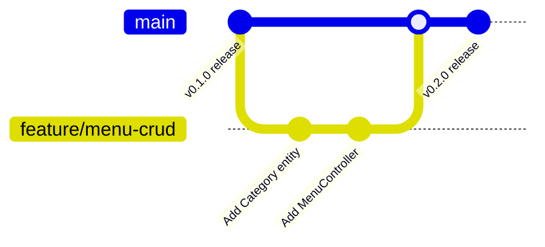

# 🤝 Contributing to Sizzle

Thank you for your interest in contributing to **Sizzle**! We welcome contributions from developers of all skill levels.

This document provides guidelines, conventions, and instructions to ensure a smooth collaboration process.

---

## 📁 Repository Structure Overview

```
Sizzle/
├── .vscode/               # Recommended IDE settings
├── assets/                # README images & branding banners
├── backend/               # Spring Boot 3.4.x Java REST Backend
│   ├── src/main/java/     # Java source packages (controller, dto, model, security, service)
│   ├── src/main/resources/# Application configurations (application-h2.properties)
│   └── pom.xml            # Maven project configuration
├── docs/                  # Specialized technical documentation
├── screenshots/           # UI screenshots organized by version tag
├── src/                   # React 19 + TypeScript frontend application
│   ├── components/        # Reusable UI components
│   ├── context/           # React Context providers (CartContext)
│   ├── services/          # API integration client (api.ts)
│   └── types.ts           # Shared TypeScript type declarations
├── package.json           # Frontend dependencies & scripts
└── tsconfig.json          # TypeScript compiler configuration
```

---

## 🌿 Git Workflow & Branch Strategy

We follow a structured Git branching model:

- `main`: Production-ready, stable codebase.
- `feature/<feature-name>`: New features or enhancements (e.g., `feature/menu-crud`).
- `fix/<bug-name>`: Bug fixes (e.g., `fix/jwt-expiration-handling`).
- `docs/<doc-name>`: Documentation additions or updates (e.g., `docs/api-contracts`).



---

## 💬 Commit Message Conventions

We enforce [Conventional Commits](https://www.conventionalcommits.org/). Commit messages must follow this structure:

```
<type>(<scope>): <short description>
```

### Supported Types
- `feat`: A new feature added to frontend or backend.
- `fix`: A bug fix.
- `docs`: Documentation changes only.
- `style`: Formatting, missing semi-colons, no code logic change.
- `refactor`: Refactoring code without changing public behavior.
- `test`: Adding missing unit or integration tests.
- `chore`: Maintenance tasks, dependency updates, build config.

### Examples
- `feat(auth): implement JWT authentication filter`
- `fix(types): add vite client reference to resolve import.meta.env`
- `docs(api): document user profile REST endpoints`

---

## 🎨 Coding Standards & Guidelines

### 1. Java / Spring Boot Standards
- **Style**: Follow Google Java Style Guide.
- **Naming**: Use `CamelCase` for classes, `camelCase` for variables and methods.
- **Validation**: Use Jakarta Bean Validation annotations (`@Valid`, `@NotNull`, `@NotBlank`) on all DTOs.
- **REST Conventions**: Return standard `ResponseEntity<ApiResponse<T>>` wrappers from all controller methods.

### 2. TypeScript / React Standards
- **Style**: Standard ESLint / Prettier formatting.
- **Components**: Functional components with explicit TypeScript prop interfaces.
- **Type Safety**: Avoid `any`. Define strict types in `src/types.ts` or interface DTOs.
- **Imports**: Clean import grouping (External libraries first, internal components second, styles third).

---

## 🛠️ Development Setup & Verification

Before submitting code, ensure that all static analysis and verification checks pass:

```bash
# 1. Verify Frontend TypeScript Compilation
npm run lint

# 2. Verify Backend Build & Compilation
cd backend
mvn clean compile
```

---

## 📬 Pull Request (PR) Process

1. **Fork & Branch**: Create your feature branch from `main`.
2. **Commit**: Make modular, well-described commits.
3. **Verify**: Ensure both `npm run lint` and `mvn compile` pass cleanly without errors.
4. **Open PR**: Submit a Pull Request targeting `main` with:
   - Clear description of changes made.
   - Reference to associated issues.
   - Verification steps or screenshots (if UI changes are included).
5. **Code Review**: Address any feedback requested by maintainers.

---

## 🔗 Related Documentation

- [Architecture Guide](file:///d:/Sizzle/Sizzle/docs/ARCHITECTURE.md)
- [Project Progress](file:///d:/Sizzle/Sizzle/PROJECT_PROGRESS.md)
- [Development Roadmap](file:///d:/Sizzle/Sizzle/ROADMAP.md)
