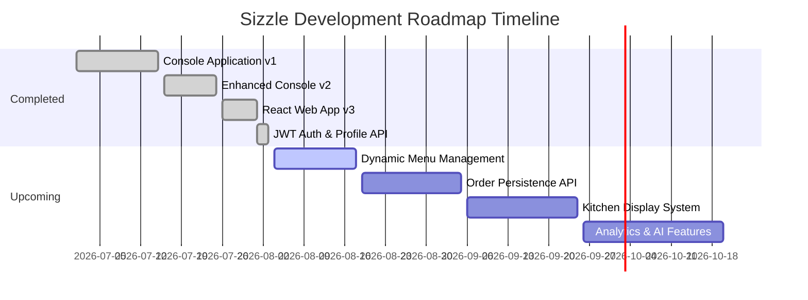

# 📊 Sizzle Project Progress Tracker

This document serves as the live progress tracker and module status log for the **Sizzle Restaurant Management System**.

---

## 📈 Executive Summary

- **Current Phase**: **Phase 1 Complete (Authentication & Baseline API)** ➔ **Phase 2 In-Progress (Menu Management)**
- **Current Module**: Spring Boot Dynamic Menu CRUD & Category REST APIs
- **Overall Project Completion**: `[███████░░░░░░░░░░░░░] 35%`
- **Last Updated**: August 03, 2026

---

## 🧩 Module Breakdown

| Module | Target Phase | Status | Completion Date |
| :--- | :---: | :---: | :---: |
| **Java Console App (v1)** | Legacy | `[Completed]` | July 2026 |
| **Enhanced Console App (v2)** | Legacy | `[Completed]` | July 2026 |
| **React Web App UI (v3)** | Baseline | `[Completed]` | July 2026 |
| **Spring Boot Setup & Architecture** | Phase 1 | `[Completed]` | August 2026 |
| **User Registration & Login (JWT)** | Phase 1 | `[Completed]` | August 2026 |
| **User Profile Management API** | Phase 1 | `[Completed]` | August 2026 |
| **Menu & Category Persistence API** | Phase 2 | `[In-Progress]` | Target Q3 2026 |
| **Order Persistence & Management API**| Phase 3/4| `[Planned]` | Target Q3 2026 |
| **Kitchen Display System (KDS)** | Phase 5 | `[Planned]` | Target Q4 2026 |
| **Inventory Tracking** | Phase 6 | `[Planned]` | Target Q4 2026 |
| **Payment Gateway Integration** | Phase 7 | `[Planned]` | Target Q1 2027 |
| **Analytics & Business Intelligence** | Phase 8 | `[Planned]` | Target Q1 2027 |
| **AI Recommendation System** | Phase 9 | `[Planned]` | Target Q2 2027 |

---

## 🏆 Recent Achievements

- ✅ Built Spring Boot 3.4 REST Backend with Java 21.
- ✅ Implemented JWT Stateless Authentication (`JwtTokenProvider`, `JwtAuthenticationFilter`).
- ✅ Created BCrypt-secured user registration and login endpoints (`/api/auth/register`, `/api/auth/login`).
- ✅ Implemented User Profile endpoints (`GET/PUT /api/users/profile`).
- ✅ Created centralized API integration client in React frontend (`src/services/api.ts`).
- ✅ Fixed TypeScript Vite environment definitions and stabilized build script (`npm run lint`).

---

## 🐛 Known Issues & Technical Debt

| ID | Issue Description | Priority | Target Fix |
| :--- | :--- | :---: | :---: |
| **ISS-001** | Frontend menu items currently use local static JSON dataset rather than fetching dynamically from backend. | `Medium` | Phase 2 |
| **ISS-002** | User cart and completed order history are stored in browser local state / context rather than database entities. | `Medium` | Phase 4 |
| **ISS-003** | H2 database is currently used in-memory; needs MySQL setup instructions for production persistence. | `Low` | Deployment |

---

## 📅 Development Timeline & Milestones

---

## 🔄 Module Update Checklist

When completing a new module, developers must update:
1. `PROJECT_PROGRESS.md` — Increment completion percentage and move module status to `[Completed]`.
2. `CHANGELOG.md` — Record version additions under `[Unreleased]` or new tag.
3. `FEATURES.md` — Move completed feature from Planned to Implemented with detailed breakdown.
4. `API_DOCUMENTATION.md` — Add new endpoint request/response JSON contracts.
5. `DATABASE_SCHEMA.md` — Add newly introduced tables, relationships, and ERD updates.
6. `README.md` — Update user-facing overview if major capabilities change.

---

## 🔗 Related Documentation

- [Features Catalog](file:///d:/Sizzle/Sizzle/docs/FEATURES.md)
- [Development Roadmap](file:///d:/Sizzle/Sizzle/ROADMAP.md)
- [Changelog](file:///d:/Sizzle/Sizzle/CHANGELOG.md)
