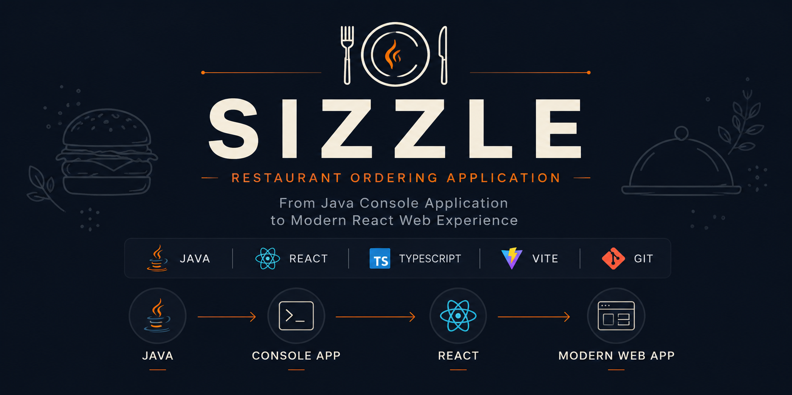
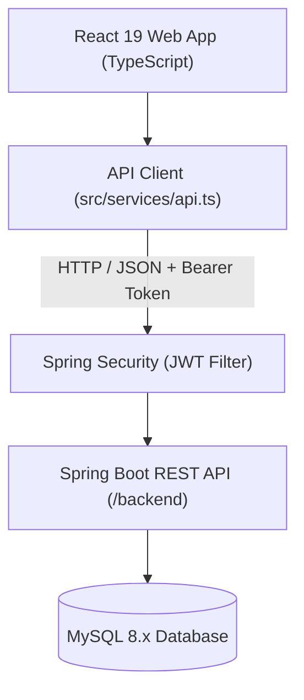

<p align="center">
  
</p>

<br>

# 🍽️ Sizzle — Restaurant Management & Ordering System

```
   _____ _ __________     __    ______
  / ___/(_)_  / __  /___ / /__ / __/ /
  \__ \/ / / /_/ /_/ / _ / / -_/ _/ /
 /____/_/ /___|__/____/_/\__/___/_/

  From a Java Console App to an Enterprise Full-Stack Web Application 🍔
```

<div align="center">


</div>

---

## 📖 Project Overview

**Sizzle** is a modern restaurant ordering and management platform built to demonstrate real software engineering evolution. The repository captures a complete journey of technical growth: starting as a **Java Console Application** (`v1`), evolving into an **Enhanced Console System** (`version2`), transitioning into a **React + TypeScript SPA** (`v3.0`), and currently scaling into an **Enterprise Spring Boot REST Backend with JWT Authentication**.

Rather than scattering progress across multiple repositories, every evolution step is preserved in a single repository using Git tags and releases.

---

## 🎯 Problem Statement & Solution

- **The Problem**: Traditional restaurant ordering systems often suffer from coupled monolithic logic, poor user experience, lack of real-time inventory tracking, and complex deployment setups.
- **The Solution**: Sizzle delivers a modular, decoupled solution combining a lightning-fast single-page web app (**React 19 + TypeScript + Vite**) with a secure, stateless REST API (**Spring Boot 3 + Spring Security + JWT**).

---

## ✨ Implemented Features Summary

- 🔑 **Stateless JWT Authentication**: Secure user registration, BCrypt password hashing, and token-based login.
- 👤 **User Profile APIs**: Authenticated profile viewing and updating via Spring Boot REST backend.
- 🎨 **Interactive Food Menu**: Category filtering, instant live search, and detailed dish views.
- 🛒 **Global Cart Management**: React Context state driven cart with item adjustment, tax calculation, and badge indicators.
- 💳 **Checkout & Digital Receipts**: Modal checkout workflow with instant itemized digital receipts.
- 📜 **Historical Order View**: Customer order tracking and receipt viewing.

*(For a complete breakdown of features, view [docs/FEATURES.md](file:///d:/Sizzle/Sizzle/docs/FEATURES.md)).*

---

## 🛠️ Technology Stack

| Tier | Technology | Purpose |
| :--- | :--- | :--- |
| **Frontend** | React 19, TypeScript 5.8, Vite 6, Tailwind CSS | Web Presentation & State Management |
| **Backend** | Java 21, Spring Boot 3.4, Spring Data JPA | REST API & Core Business Logic |
| **Security** | Spring Security 6, JJWT, BCrypt | Stateless Authentication & Authorization |
| **Database** | MySQL 8.x (Exclusive Database Provider) | Relational Persistence |
| **Build Tools** | Maven, npm, esbuild | Package Management & Compilation |

---

## 🏗️ Architecture Overview



*(For detailed sequence diagrams and component layouts, see [docs/ARCHITECTURE.md](file:///d:/Sizzle/Sizzle/docs/ARCHITECTURE.md)).*

---

## 🚀 Quick Start Guide

### Prerequisites
- Node.js `v18+` & npm `v9+`
- Java JDK `17+` (JDK 21 Recommended)
- Maven `3.8+`

### 1. Frontend Setup

```bash
# Clone the repository
git clone https://github.com/Nithz-codes/sizzle.git
cd sizzle

# Install frontend dependencies
npm install

# Start Vite dev server (http://localhost:3000)
npm run dev
```

### 2. Backend Setup

```bash
# Open a new terminal in the backend directory
cd backend

# Run Spring Boot application (http://localhost:8080/api)
mvn spring-boot:run
```

*(For database configurations and production deployment details, see [docs/DEPLOYMENT.md](file:///d:/Sizzle/Sizzle/docs/DEPLOYMENT.md)).*

---

## 📸 Screenshots Overview

| Web App Menu | Checkout & Receipt |
| :---: | :---: |
|  |  |

*(View the complete screenshot gallery across all version tags in [docs/SCREENSHOTS.md](file:///d:/Sizzle/Sizzle/docs/SCREENSHOTS.md)).*

---

## 📂 Project Directory Structure

```
Sizzle/
├── backend/            # Spring Boot REST Server (Java 21)
├── docs/               # Technical Documentation Suite
├── screenshots/        # Application Screenshots Gallery
├── src/                # React + TypeScript Frontend
│   ├── components/     # UI Components
│   ├── context/        # React Context Providers
│   └── services/       # Centralized API Service (api.ts)
├── PROJECT_PROGRESS.md # Live Module & Progress Tracker
├── ROADMAP.md          # Multi-Phase Strategic Roadmap
├── CHANGELOG.md        # Release & Changes Log
└── CONTRIBUTING.md     # Open Source Guidelines
```

---

## 📚 Technical Documentation Index

| Document | Description |
| :--- | :--- |
| 📊 **[PROJECT_PROGRESS.md](file:///d:/Sizzle/Sizzle/PROJECT_PROGRESS.md)** | Live progress tracker, completion metrics, and active module checklist. |
| 🗺️ **[ROADMAP.md](file:///d:/Sizzle/Sizzle/ROADMAP.md)** | Multi-phase strategic roadmap (Phases 1 through 9). |
| 📝 **[CHANGELOG.md](file:///d:/Sizzle/Sizzle/CHANGELOG.md)** | Semantic release notes and version history. |
| 🤝 **[CONTRIBUTING.md](file:///d:/Sizzle/Sizzle/CONTRIBUTING.md)** | Branching rules, coding standards, and PR guidelines. |
| 🏗️ **[docs/ARCHITECTURE.md](file:///d:/Sizzle/Sizzle/docs/ARCHITECTURE.md)** | In-depth frontend/backend system architecture and sequence diagrams. |
| 🚀 **[docs/FEATURES.md](file:///d:/Sizzle/Sizzle/docs/FEATURES.md)** | Implemented and planned feature matrix. |
| 📡 **[docs/API_DOCUMENTATION.md](file:///d:/Sizzle/Sizzle/docs/API_DOCUMENTATION.md)** | Complete REST API endpoint reference and JSON schemas. |
| 🗄️ **[docs/DATABASE_SCHEMA.md](file:///d:/Sizzle/Sizzle/docs/DATABASE_SCHEMA.md)** | JPA entities, database tables, and Mermaid ERD. |
| 🔒 **[docs/SECURITY.md](file:///d:/Sizzle/Sizzle/docs/SECURITY.md)** | JWT authentication flow, BCrypt encryption, and RBAC rules. |
| 🚀 **[docs/DEPLOYMENT.md](file:///d:/Sizzle/Sizzle/docs/DEPLOYMENT.md)** | Local environment setup, H2 to MySQL migration, and build commands. |
| 🖼️ **[docs/SCREENSHOTS.md](file:///d:/Sizzle/Sizzle/docs/SCREENSHOTS.md)** | Structured visual gallery for past and present versions. |

---

## 🕹️ Viewing Historical Versions

This repository preserves legacy console versions via **Git Tags**:

```bash
# View initial Java console app (v1)
git switch --detach v1

# View enhanced Java console app (version2)
git switch --detach version2

# Return to active main branch
git switch main
```

---

## 🔮 Roadmap Summary

- 🟢 **Phase 1**: Authentication & User Profile REST APIs `[Completed]`
- 🟡 **Phase 2**: Dynamic Menu & Category Management `[In-Progress]`
- 🔵 **Phase 3/4**: Order Management & Database Persistence `[Planned]`
- 🟣 **Phase 5/6**: Kitchen Display System & Inventory Management `[Planned]`
- 🟠 **Phase 7/8**: Payment Processing & Admin Analytics `[Planned]`
- 🤖 **Phase 9**: AI Dietary & Order Recommendations `[Planned]`

---

## 👤 Author & License

**Nithish V** — [@Nithz-codes](https://github.com/Nithz-codes)

Distributed under the **MIT License**. See `LICENSE` for details.
