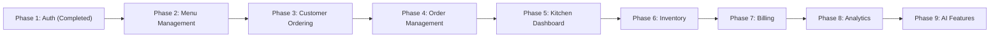

# 🗺️ Sizzle Strategic Development Roadmap

This document outlines the multi-phase engineering roadmap for **Sizzle**, detailing architectural objectives, expected deliverables, technical dependencies, and completion criteria for each milestone.

---

## 🎯 Phase Overview

---

## 🟢 Phase 1: User Authentication & Security `[Completed]`

- **Objectives**: Establish secure, stateless authentication and user profile management in Spring Boot backend.
- **Expected Deliverables**:
  - JWT token provider and security filter chain.
  - BCrypt password hashing.
  - User registration (`POST /api/auth/register`), login (`POST /api/auth/login`), and profile APIs (`GET/PUT /api/users/profile`).
- **Dependencies**: Spring Boot 3, Spring Security 6, JJWT, H2 Database.
- **Completion Criteria**: Clean static analysis (`npx tsc --noEmit`), working auth endpoints returning signed JWT tokens, authenticated profile fetch.

---

## 🟡 Phase 2: Menu & Category Management `[In-Progress]`

- **Objectives**: Transition food items from client-side static JSON to dynamic backend database management.
- **Expected Deliverables**:
  - `Category` and `MenuItem` JPA Entities, Repositories, and REST Controllers (`/api/menu`, `/api/categories`).
  - Image URL storage support and dietary tags (Vegetarian, Vegan, Gluten-Free).
  - Admin-only CRUD operations (`ROLE_ADMIN`) for adding, editing, and disabling menu items.
- **Dependencies**: Phase 1 Authentication & RBAC.
- **Completion Criteria**: Public GET menu APIs, protected POST/PUT/DELETE menu APIs, frontend menu integrated with backend REST API.

---

## 🔵 Phase 3: Enhanced Customer Ordering `[Planned]`

- **Objectives**: Refine customer ordering experience with custom dish options and dietary preferences.
- **Expected Deliverables**:
  - Customization options (spice levels, portion sizes, add-ons).
  - Real-time item availability checking before adding to cart.
  - Favorites and saved meal preferences per user profile.
- **Dependencies**: Phase 2 Menu Management.
- **Completion Criteria**: Frontend ordering UI supporting add-ons and validation against live backend inventory status.

---

## 🔵 Phase 4: Order Management & Persistence `[Planned]`

- **Objectives**: Persist all customer checkouts to database entities and expose order status updates.
- **Expected Deliverables**:
  - `Order` and `OrderItem` JPA models with foreign keys to `users` and `menu_items`.
  - POST `/api/orders` checkout submission API.
  - GET `/api/orders/user` historical orders API replacing local state mock history.
- **Dependencies**: Phase 1 (Users), Phase 2 (Menu Items).
- **Completion Criteria**: End-to-end checkout persisting orders to H2/MySQL and retrieving itemized order histories.

---

## 🟣 Phase 5: Kitchen Display System (KDS) `[Planned]`

- **Objectives**: Build a dedicated interface for kitchen staff (`ROLE_CHEF`) to track and update order fulfillment.
- **Expected Deliverables**:
  - Kitchen Dashboard web page displaying active orders.
  - Status progression API: `PENDING` ➔ `PREPARING` ➔ `READY` ➔ `DELIVERED`.
  - Real-time WebSocket / SSE notifications for incoming kitchen tickets.
- **Dependencies**: Phase 4 Order Persistence.
- **Completion Criteria**: Chefs can view order queue and change statuses in real time.

---

## 🟣 Phase 6: Inventory & Ingredient Management `[Planned]`

- **Objectives**: Track ingredient levels and automatically deduct stock upon order placement.
- **Expected Deliverables**:
  - `Ingredient` entity and recipe mapping per `MenuItem`.
  - Automated stock reduction and low-stock alert thresholds.
  - Inventory management view for restaurant managers (`ROLE_MANAGER`).
- **Dependencies**: Phase 2 (Menu Items), Phase 4 (Orders).
- **Completion Criteria**: Placing an order decrements stock; out-of-stock items automatically disable menu items.

---

## 🟠 Phase 7: Billing & Payment Gateway Integration `[Planned]`

- **Objectives**: Integrate real-world electronic payment processing.
- **Expected Deliverables**:
  - Integration with Stripe / PayPal payment APIs.
  - Webhook listener for payment confirmation (`POST /api/webhooks/stripe`).
  - Invoice PDF download generation for receipts.
- **Dependencies**: Phase 4 Order Persistence.
- **Completion Criteria**: Successful card authorization flow transitioning order state to `PAID`.

---

## 🔴 Phase 8: Business Intelligence & Analytics `[Planned]`

- **Objectives**: Provide restaurant administrators with actionable insights into sales performance.
- **Expected Deliverables**:
  - Revenue, profit margin, and sales growth charts.
  - Top-selling dishes report and peak operating hour heatmaps.
  - Export capabilities (CSV, PDF summary reports).
- **Dependencies**: Phase 4 (Orders), Phase 6 (Inventory), Phase 7 (Billing).
- **Completion Criteria**: Interactive dashboard displaying real sales metrics pulled from historical orders.

---

## 🤖 Phase 9: AI-Powered Features `[Planned]`

- **Objectives**: Integrate Generative AI for personalized meal suggestions and automated customer support.
- **Expected Deliverables**:
  - Gemini-powered dietary recommendation assistant ("Find me a high-protein lunch under $20").
  - Automated chef notes generator for menu item descriptions.
  - Predictive inventory forecasting.
- **Dependencies**: Phase 2 (Menu), Phase 4 (Orders).
- **Completion Criteria**: AI assistant providing accurate recommendations based on menu database.

---

## 🔗 Related Documentation

- [Project Progress Tracker](file:///d:/Sizzle/Sizzle/PROJECT_PROGRESS.md)
- [Features Catalog](file:///d:/Sizzle/Sizzle/docs/FEATURES.md)
- [Architecture Overview](file:///d:/Sizzle/Sizzle/docs/ARCHITECTURE.md)
