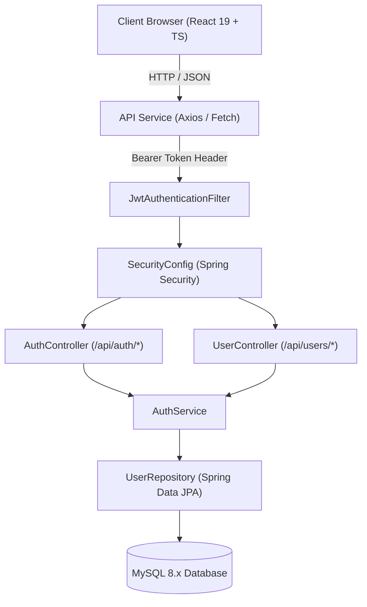
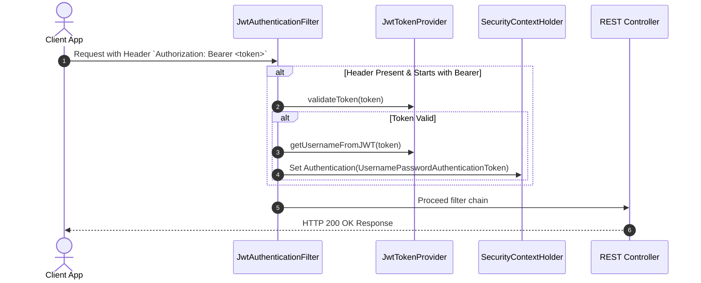
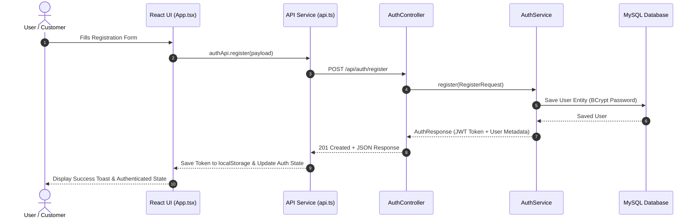

# 🏗️ Sizzle Architecture Documentation

This document describes the architectural design and system structure of the **Sizzle Restaurant Management System**.

---

## 📐 System Overview

Sizzle is built using a modern decoupled architecture, separating the client-side presentation layer (**React + TypeScript + Vite**) from the server-side business logic and persistence layer (**Spring Boot + Spring Security + Spring Data JPA**).



---

## 🎨 Frontend Architecture

The frontend application resides in the root `/src` directory and is constructed using **React 19**, **TypeScript**, and **Vite**.

```
src/
├── assets/          # Static images & branding assets
├── components/      # Modular UI components (Navbar, Hero, Menu, Cart, Modals)
├── context/         # React Context providers for global state (CartContext)
├── data/            # Local data models & mock dataset
├── services/        # Centralized HTTP API client (api.ts)
├── types.ts         # Global TypeScript interfaces & type definitions
├── main.tsx         # Application entrypoint
└── vite-env.d.ts    # Vite ambient client types
```

### Key Architectural Concepts
- **Component-Based UI**: Atomic, reusable components styled with custom CSS and Tailwind utilities.
- **Global State Management**: React Context API (`CartContext`) manages cart items, totals, badge counters, and checkout states across component boundaries.
- **Centralized API Service**: [src/services/api.ts](file:///d:/Sizzle/Sizzle/src/services/api.ts) abstracts HTTP requests, injecting `Authorization: Bearer <token>` headers from `localStorage`.

---

## ☕ Backend Architecture

The backend application lives inside the `/backend` directory and is powered by **Spring Boot 3.4.x** and **Java 21**.

```
backend/src/main/java/com/sizzle/backend/
├── SizzleBackendApplication.java   # Spring Boot Application Entry point
├── config/                        # Global CORS & application beans
├── controller/                    # REST API Controllers (AuthController, UserController)
├── dto/                           # Data Transfer Objects & validation schemas
├── exception/                     # Global exception handlers & custom errors
├── model/                         # JPA Entities (User, Role, AccountStatus)
├── repository/                    # Spring Data JPA Repositories (UserRepository)
├── security/                      # JWT Providers, Security Config, UserDetails Service
└── service/                       # Business logic services (AuthService)
```

---

## 🔒 Security Architecture

The backend employs a **Stateless JWT (JSON Web Token)** security model powered by **Spring Security**.



### Security Highlights
- **Password Hashing**: Passwords are salted and hashed using `BCryptPasswordEncoder`.
- **CORS Management**: Fine-grained CORS configuration allows frontend origins (`localhost:3000`, `localhost:5173`) while denying unauthorized cross-origin requests.
- **CSRF Protection**: Disabled for REST APIs relying on stateless JWT headers.

---

## 🗄️ Database Layer

- **Database Engine**: MySQL 8.x Database (configured via `application.properties`).
- **ORM & Data Mapping**: Spring Data JPA with Hibernate.
- **Schema Auto-Generation**: Tables are automatically generated on backend startup (`spring.jpa.hibernate.ddl-auto=update`).

---

## 🔄 Application Data Flow



---

## 🔗 Related Documentation

- [Features Catalog](file:///d:/Sizzle/Sizzle/docs/FEATURES.md)
- [API Documentation](file:///d:/Sizzle/Sizzle/docs/API_DOCUMENTATION.md)
- [Database Schema](file:///d:/Sizzle/Sizzle/docs/DATABASE_SCHEMA.md)
- [Security Architecture](file:///d:/Sizzle/Sizzle/docs/SECURITY.md)
