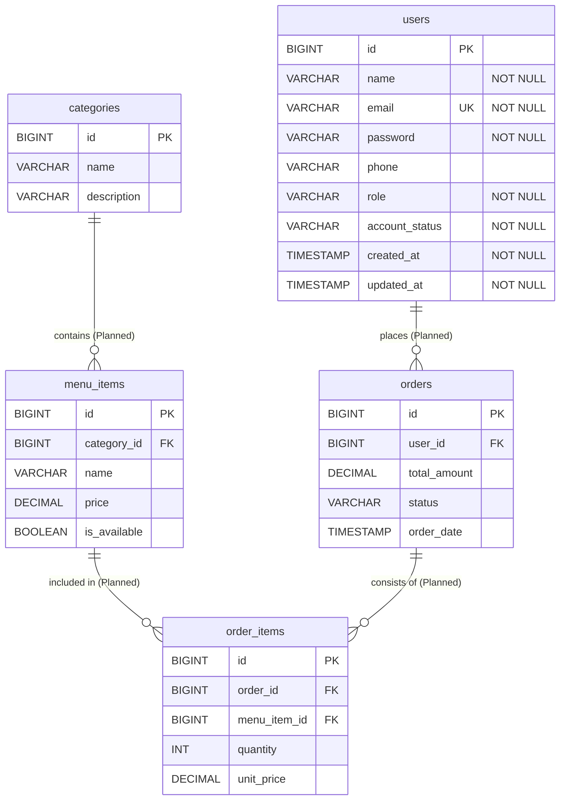

# 🗄️ Sizzle Database Schema Documentation

This document describes the database design, entity models, table structures, and relationship schemas for the **Sizzle** platform.

---

## 📊 Entity Relationship Diagram (Current & Planned)



---

## 🟢 Implemented Schema Details

### 1. `users` Table

Maps to domain entity: `com.sizzle.backend.model.User`

| Column Name | Data Type | Nullable | Default / Constraints | Description |
| :--- | :--- | :---: | :--- | :--- |
| `id` | `BIGINT` | **No** | Primary Key, Auto-Increment (`IDENTITY`) | Unique identifier for each user |
| `name` | `VARCHAR(100)` | **No** | Non-blank | Full user display name |
| `email` | `VARCHAR(150)` | **No** | Unique Index | Account login email address |
| `password` | `VARCHAR(255)` | **No** | BCrypt Hash | Hashed user password |
| `phone` | `VARCHAR(20)` | Yes | Optional | Contact phone number |
| `role` | `VARCHAR(20)` | **No** | Enum String | User access role (`CUSTOMER`, `ADMIN`, etc.) |
| `account_status` | `VARCHAR(20)` | **No** | Default: `ACTIVE` | Account state (`ACTIVE`, `INACTIVE`, `SUSPENDED`) |
| `created_at` | `TIMESTAMP` | **No** | `@PrePersist` Timestamp | Record creation timestamp |
| `updated_at` | `TIMESTAMP` | **No** | `@PreUpdate` Timestamp | Record last update timestamp |

#### Enumerations
- **Role Enum (`Role.java`)**: `CUSTOMER`, `ADMIN`, `CHEF`, `MANAGER`, `CASHIER`, `WAITER`
- **AccountStatus Enum (`AccountStatus.java`)**: `ACTIVE`, `INACTIVE`, `SUSPENDED`

#### Indexes & Constraints
- **Primary Key**: `PRIMARY KEY (id)`
- **Unique Constraint**: `CONSTRAINT UK_users_email UNIQUE (email)`

---

## ⏳ Planned Database Tables (Upcoming Milestones)

The following tables are planned for Phase 2 (Menu) and Phase 4 (Orders):

### `categories` Table *(Planned - Phase 2)*
- `id`: `BIGINT` (PK)
- `name`: `VARCHAR(50)` (Unique)
- `icon`: `VARCHAR(50)`
- `description`: `TEXT`

### `menu_items` Table *(Planned - Phase 2)*
- `id`: `BIGINT` (PK)
- `category_id`: `BIGINT` (FK -> `categories.id`)
- `name`: `VARCHAR(100)`
- `description`: `TEXT`
- `price`: `DECIMAL(10,2)`
- `image_url`: `VARCHAR(255)`
- `is_available`: `BOOLEAN`

### `orders` Table *(Planned - Phase 4)*
- `id`: `BIGINT` (PK)
- `user_id`: `BIGINT` (FK -> `users.id`)
- `total_amount`: `DECIMAL(10,2)`
- `status`: `VARCHAR(30)` (`PENDING`, `CONFIRMED`, `PREPARING`, `READY`, `DELIVERED`, `CANCELLED`)
- `delivery_address`: `TEXT`
- `payment_method`: `VARCHAR(30)`
- `created_at`: `TIMESTAMP`

### `order_items` Table *(Planned - Phase 4)*
- `id`: `BIGINT` (PK)
- `order_id`: `BIGINT` (FK -> `orders.id`)
- `menu_item_id`: `BIGINT` (FK -> `menu_items.id`)
- `quantity`: `INT`
- `price`: `DECIMAL(10,2)`

---

## ⚙️ H2 Configuration

The backend is pre-configured with H2 in-memory database settings in `application-h2.properties`:

```properties
spring.datasource.url=jdbc:h2:mem:sizzledb
spring.datasource.driverClassName=org.h2.Driver
spring.datasource.username=sa
spring.datasource.password=
spring.h2.console.enabled=true
spring.h2.console.path=/h2-console
spring.jpa.hibernate.ddl-auto=update
```

---

## 🔗 Related Documentation

- [Architecture Overview](file:///d:/Sizzle/Sizzle/docs/ARCHITECTURE.md)
- [API Documentation](file:///d:/Sizzle/Sizzle/docs/API_DOCUMENTATION.md)
- [Deployment Guide](file:///d:/Sizzle/Sizzle/docs/DEPLOYMENT.md)
