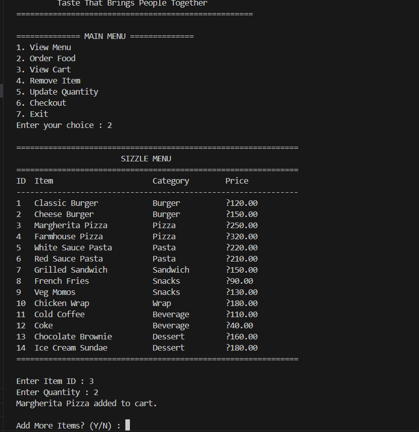
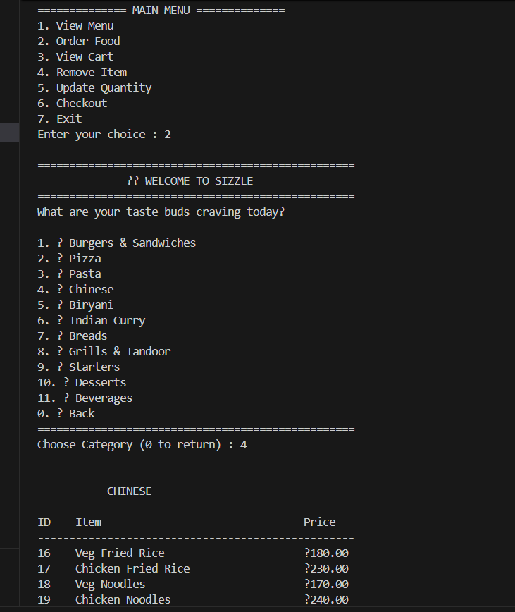
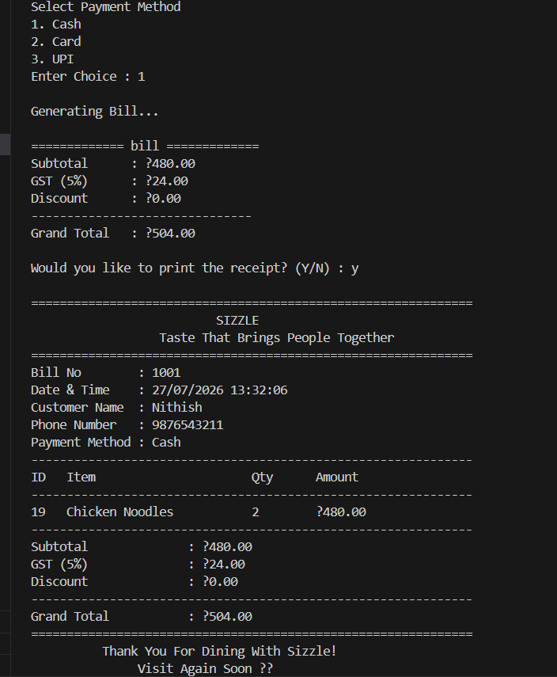
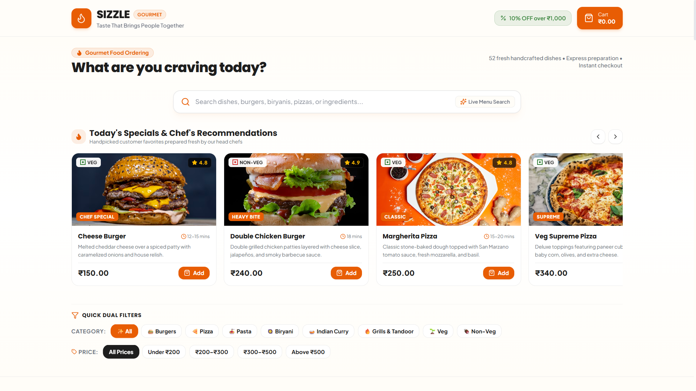
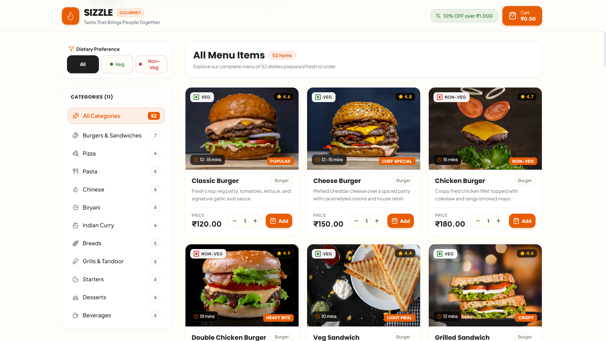
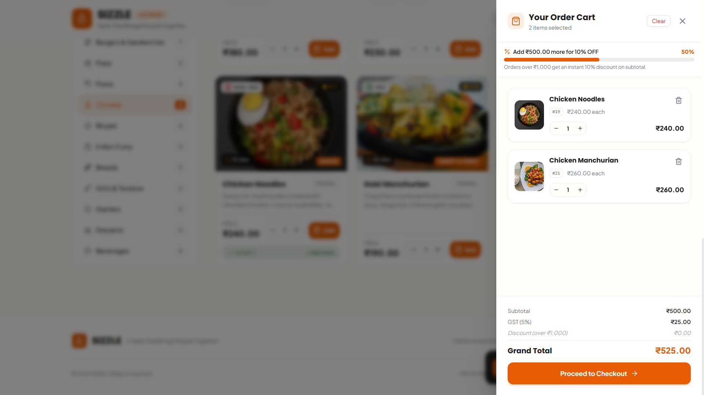
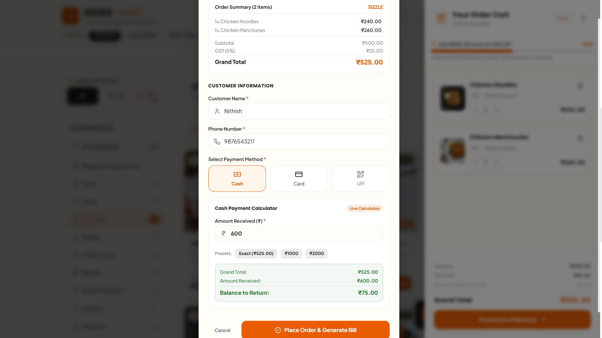
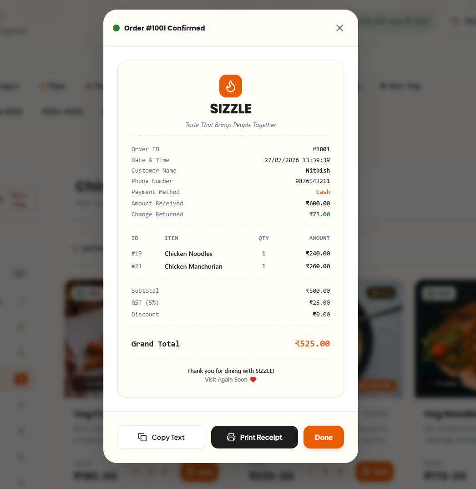
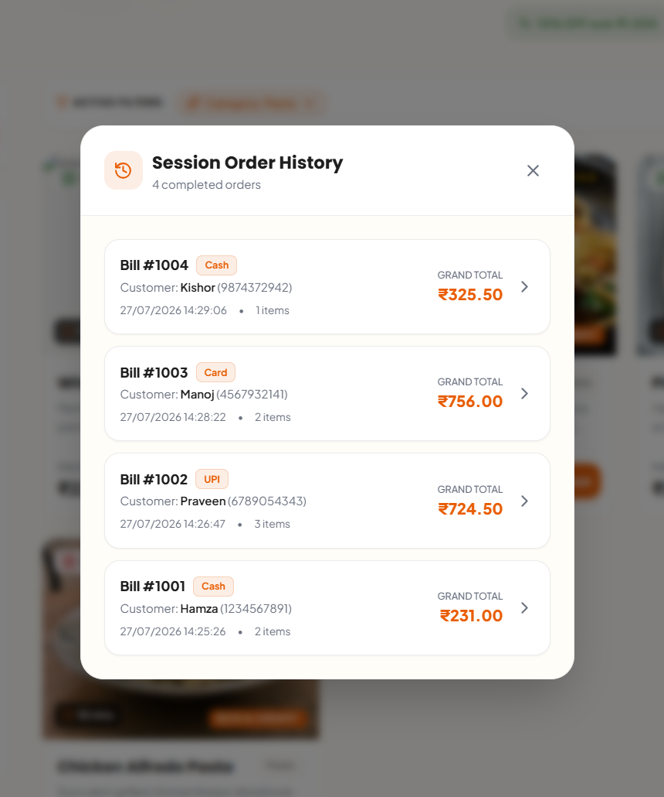

# 🖼️ Sizzle Visual Gallery & Screenshots

This document showcases visual screenshots across the evolution stages of **Sizzle**, from early Java console prototypes to the current modern web interface, along with preview placeholders for upcoming dashboards.

---

## 🟤 Stage 1 — Initial Java Console Application (v1)

| Console Terminal Menu |
| :---: |
|  |
| *Initial Java CLI restaurant ordering interface featuring basic menu navigation and terminal output.* |

---

## 🟠 Stage 2 — Enhanced Java Console Application (v2)

| Refined Console Menu | Billing & Receipt Output |
| :---: | :---: |
|  |  |
| *Expanded category display and input validation.* | *Formatted text receipt output generated directly in terminal.* |

---

## 🟢 Stage 3 — Modern Web Application (v3.0 - Current)

### 🏠 1. Discover & Browse

| Landing Page | Interactive Menu & Category Filters |
| :---: | :---: |
|  |  |
| *Hero section with search and navigation.* | *Category sidebar, live search bar, and food cards.* |

---

### 🛒 2. Cart & Review

| Slide-over Cart | Checkout Modal |
| :---: | :---: |
|  |  |
| *Real-time cart badge, subtotals, and item adjustment.* | *Delivery address details and payment selection.* |

---

### 📜 3. Confirmation & Order History

| Itemized Digital Receipt | Customer Order History |
| :---: | :---: |
|  |  |
| *Detailed receipt modal generated post checkout.* | *Historical record of placed orders.* |

---

## ⏳ Future Module Previews (Planned)

### 🧑‍🍳 Kitchen Display System (KDS) *(Planned - Phase 5)*
> `[ Screenshot Placeholder: Live order queue with PENDING -> PREPARING -> READY controls ]`

### 📊 Admin Analytics Dashboard *(Planned - Phase 8)*
> `[ Screenshot Placeholder: Revenue charts, popular item metrics, and peak hour reports ]`

---

## 🔗 Related Documentation

- [Features Catalog](file:///d:/Sizzle/Sizzle/docs/FEATURES.md)
- [Architecture Overview](file:///d:/Sizzle/Sizzle/docs/ARCHITECTURE.md)
- [Project Progress](file:///d:/Sizzle/Sizzle/PROJECT_PROGRESS.md)
