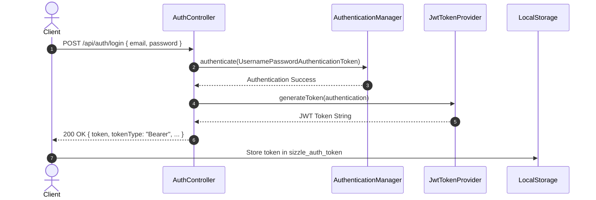
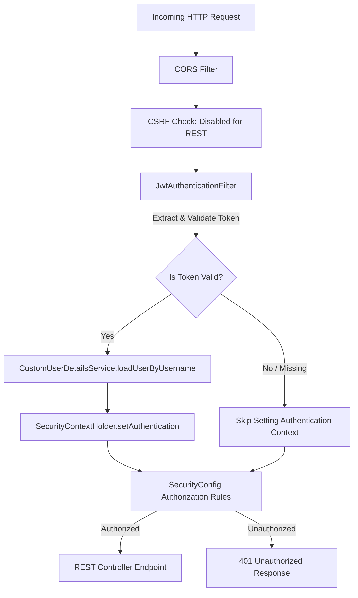

# 🔒 Sizzle Security Documentation

This document specifies the security architecture, authentication protocols, authorization models, and security best practices implemented in **Sizzle**.

---

## 🛡️ Security Overview

Sizzle uses enterprise-standard security patterns:
- **Stateless Authentication**: Uses signed JSON Web Tokens (JWT).
- **Strong Password Hashing**: Passwords encrypted via BCrypt.
- **Declarative Web & Method Security**: Managed via Spring Security 6 (`@EnableWebSecurity`, `@EnableMethodSecurity`).
- **Strict Transport Controls**: Fine-grained CORS configuration and frame options.

---

## 🔑 Authentication Architecture

### 1. Password Encryption (BCrypt)

All raw user passwords received at `POST /api/auth/register` are encoded using Spring Security's `BCryptPasswordEncoder` before persistence:

```java
@Bean
public PasswordEncoder passwordEncoder() {
    return new BCryptPasswordEncoder();
}
```

Key security properties:
- Uses random salting per password generation.
- One-way hashing algorithm preventing plain-text password recovery.
- Verification performed via `passwordEncoder.matches(rawPassword, encodedPassword)`.

---

### 2. JWT Authentication Mechanism

Authentication issues a signed JWT token containing user identity claims (`username`/`email`).



#### Token Characteristics
- **Algorithm**: HMAC SHA-256 (`HS256` / `HS512`)
- **Header Type**: `Bearer`
- **Expiration**: Default 24 hours (configurable via `app.jwt.expiration-milliseconds`)
- **Secret Key**: Configurable via `app.jwt.secret` environment variable

---

## 🔐 Authorization Flow

Protected endpoints require the HTTP header:
```http
Authorization: Bearer <JWT_TOKEN>
```



---

## 👥 Role-Based Access Control (RBAC)

The domain model supports granular access roles (`Role` enum):

- `CUSTOMER`: Standard dining customer (browse menu, place orders, update personal profile).
- `ADMIN`: Platform administrator with full CRUD permissions over menu, users, and settings.
- `CHEF`: Kitchen staff managing order statuses.
- `MANAGER`: Restaurant manager viewing analytics and inventory.
- `CASHIER` & `WAITER`: In-house staff roles.

Route access rules configured in [SecurityConfig.java](file:///d:/Sizzle/Sizzle/backend/src/main/java/com/sizzle/backend/security/SecurityConfig.java):

```java
.authorizeHttpRequests(auth -> auth
    .requestMatchers(HttpMethod.OPTIONS, "/**").permitAll()
    .requestMatchers("/api/auth/**").permitAll()
    .requestMatchers(HttpMethod.GET, "/api/menu/**").permitAll()
    .requestMatchers("/error").permitAll()
    .anyRequest().authenticated()
)
```

---

## 🌐 Cross-Origin Resource Sharing (CORS)

CORS is explicitly configured to prevent unauthorized origins while permitting developer environments:

- **Allowed Origins**: Configured via `app.cors.allowed-origins` property (`http://localhost:3000`, `http://localhost:5173`).
- **Allowed Methods**: `GET`, `POST`, `PUT`, `PATCH`, `DELETE`, `OPTIONS`.
- **Exposed Headers**: `Authorization`.

---

## 🛡️ Security Checklist & Recommendations

> [!IMPORTANT]
> - **Production JWT Secret**: Ensure `app.jwt.secret` is overridden with a strong 256-bit environment key in production.
> - **Production Database Security**: Ensure `SPRING_DATASOURCE_PASSWORD` is configured via secure environment variables in production.
> - **HTTPS Enforcement**: Deploy TLS/SSL certificates in production to encrypt tokens in transit.

---

## 🔗 Related Documentation

- [Architecture Guide](file:///d:/Sizzle/Sizzle/docs/ARCHITECTURE.md)
- [API Documentation](file:///d:/Sizzle/Sizzle/docs/API_DOCUMENTATION.md)
- [Deployment Guide](file:///d:/Sizzle/Sizzle/docs/DEPLOYMENT.md)
